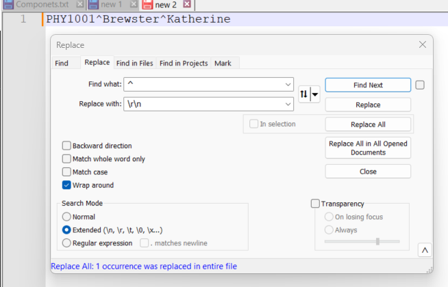
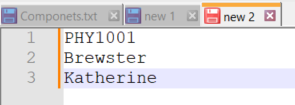

<h1 id='astm-e1394-message-parsing'><span><center>Introduction to ASTM Message Formats</center></span></h1>
<p style="text-align:center">Theron W. Genaux</p>
<p style="text-align:center">Revision 1</p>
<p style="text-align:center">5-August-2024</p>


# Introduction

The ASTM E1394 standard was created over 30 years ago. However, Laboratory Information Systems (LIS), middleware, and clinical laboratory instruments still use messages based on the ASTM E1394 (now LIS02) standard. I will use "ASTM" throughout this document to refer to the ASTM E1394, LIS2, and LIS02 standards.

Here is an example of an immunohematology-based ASTM message. I want to help you understand its structure and identify each part. Don't worry, we won't cover everything all at once. We'll start with the basics and then move on to more complex messages as we go along.

```ASTM
H|\^&|||OCD^VISION^5.13.1.46935^J60009999|||||||P|LIS2-A|20210309142633
P|1|PID123456||NID123456^MID123456^OID123456|Brown^Bobby^B|White|19650102030400|U|||||PHY1234^Kildare^James^P|Blaine
O|1|SID305||ABO|N|20210309142136|||||||||CENTBLOOD|||||||20210309142229|||R
R|1|ABO|B|||||R||Automatic||20210309142229|J60009999
R|2|Rh|POS|||||R||Automatic||20210309142229|J60009999
L|1|N
```

An ASTM message comprises lines called records, a list of fields separated by a pipe character (|). Every record begins with a Record Type ID, like O, for the Order record, which indicates the type of data contained in that record.

# Field Separator

Let's start with an ASTM Order record containing only essential information and nothing more.

```ASTM
O|1|SID101||ABORH|||||||||||CENTBLOOD
```

The table below shows the fields in the above Order record and their field position number, Data Type, and values. The field position in the record identifies its Data Type.  

 

ASTM messages use field separators, making it easy for computers to create and read them.

Let me show you how to manually disassemble this Order record and identify each field and the type of information it contains.

You can use any text editor that can show line numbers and can replace each field separator (|) with a line break. I'll demonstrate with Notepad++.

    

The first step is to split the fields in the record into separate lines. In the Replace dialog:

1. Enter the field separator. 
2. Enter the new line characters: \r\n
3. Enable the Extended search.
4. Click Replace All

You now have a list of fields where each line number is also its field position.

 

Field names and their position are defined in the ASTM standard. The specification for the Order record is in section 8 of the ASTM E1394-97 standard. The field definitions start with section 8.4.1 (Record Type ID). The field position is the last number of the section number that defines it, 1 for the  Record Type ID. 

The Specimen ID is in section 8.4.3 and is referred to as O.3 for Order record field 3.

Below, I list the fields, their position notation, Data Type, and value.

| Position | Data Type           | Value     |
| -------- | ------------------- | --------- |
| O.1      | Record Type ID      | O         |
| O.2      | Sequence Number     | 1         |
| O.3      | Specimen ID         | SID101    |
| O.5      | Test ID             | ABORH     |
| O.16     | Specimen Descriptor | CENTBLOOD |

You can reverse the process to create an Order record manually.

  

To hand code an Order record:

1. Enter each field attribute on the line number corresponding to its position as defined by the ASTM standard or the manufacturer's LIS interface guide. For example, the sample ID goes in field 3 for an Order record, so write it on line 3.
2. Enter the new line characters: \r\n
3. Enter the field separator. 
4. Enable the Extended search.
5. Click *Replace all*

Now, we have manually created an Order record. Computers are programmed to do something similar.

 


# Repeat Field Separator

A Repeat field contains multiple unique field values. For example, an order record with multiple Specimen IDs, such as a pair of blood samples from the same draw, one containing packed red blood cells and the other plasma.

```ASTM
O|1|SID102\SID103||ABO FWD/RVS|||||||||||PACKEDCELLS\PLASMA
```

If we break the above Order record into fields, we get the following fields and values:

| Position | Data Type           | Value              |
| -------- | ------------------- | ------------------ |
| O.1      | Record Type ID      | O                  |
| O.2      | Sequence Number     | 1                  |
| O.3      | Specimen ID         | SID102\SID103      |
| O.5      | Test ID             | ABO FWD/RVS        |
| O.16     | Specimen Descriptor | PACKEDCELLS\PLASMA |

Field O.3, Specimen ID is a Repeat field. We can split the O.3 field into the repeated fields by replacing the  Repeat field separator (\\) with new lines. This is identical to what we did with fields.


```ASTM
SID102\SID103
```

And we end up with the following:

  

The notation for repeat fields is their filed notation plus their repeat field position.  For sample ID SID103, the notation is O.3.2.

Below, I list the complete order record field position notations, Data Types, and values.

| Position | Data Type           | Value       |
| -------- | ------------------- | ----------- |
| O.1      | Record Type ID      | O           |
| O.2      | Sequence Number     | 1           |
| O.3.1    | Specimen ID         | SID102      |
| O.3.2    | Specimen ID         | SID103      |
| O.5      | Test ID             | ABO FWD/RVS |
| O.16.1   | Specimen Descriptor | PACKEDCELLS |
| O.16.2   | Specimen Descriptor | PLASMA      |

  

# Component Separator

One data type that occurs in ASTM is a person's full name.  ASTM specifies that full names follow this format: last name, first name, middle name or initial, suffix, and title. Full names have several components, and the component separator separates each part.  Naming conventions vary considerably around the world. Full names can be in any format agreed upon between the sender and the receiver. This means the parts of a full name do not have to be separated by the component separator. When more than one full name is required, they are separated by a repeat separator.

Let's add a couple of ordering physicians to our order record. Physicians can be identified by their Identifier code, names, or both. I will use both in our example.

```ASTM
O|1|SID101||ABORH|||||||||||CENTBLOOD|PHY1001^Brewster^Katherine\PHY1002^McCoy^Leonard^H
```

As we know, the first step is to break the order record into fields. 

 


We can see that O.17 is the ordering physician field and contains two repeat fields separated by the repeat field separator (\\).

```ASTM
PHY1001^Brewster^Katherine\PHY1002^McCoy^Leonard^H
```

We copy this field into another tab and break the repeat fields into separate lines.  

 

We'll copy the first repeat field, O.17.1, into another tab and break the components into separate lines.  

```astm
PHY1001^Brewster^Katherine
```

We will do the same with the component separator (^) as we did with the field separator.

 

O.17.1.1 is the physician ID, O.17.1.2 is the last name, and O.17.1.3 is the first name.

 

Below is a list of the fields, their position notation, Data Type, and value.

| Position | Data Type                     | Value     |
| -------- | ----------------------------- | --------- |
| O.1      | Record Type ID                | O         |
| O.2      | Sequence Number               | 1         |
| O.3      | Specimen ID                   | SID101    |
| O.5      | Test ID                       | ABORH     |
| O.17.1.1 | Physician [1] - Identifier    | PHY1001   |
| O.17.1.2 | Physician [1] - Last Name     | Brewster  |
| O.17.1.3 | Physician [1]- First Name     | Katherine |
| O.17.2.1 | Physician [1] - Identifier    | PHY1002   |
| O.17.2.2 | Physician [1] - Last Name     | McCoy     |
| O.17.2.3 | Physician [1]- First Name     | Leonard   |
| O.17.2.4 | Physician [1]- Middle Initial | H         |
| O.16     | Specimen Descriptor           | CENTBLOOD |


# Escape Sequences

Separators and escape characters can vary with each message; they are defined in the Header record and used throughout the message. The escape character is the last of the four defined characters in the header. Its primary purpose is to create a sequence of characters to replace message separator characters used in field data. There is also an escape sequence for the escape character. 

ASTM messages use escape sequences to handle situations where the standard field separator character might appear within the data. 

- **Standard Separators:** The structure of an ASTM message uses specific characters to separate different data elements. Depending on the specific implementation, these separators could be commas, pipes ("|"), or other characters.

- **Data with Separators:**  Sometimes, the data might contain the same character used in the structure of the message.

Escape sequences avoid confusion when the receiver reads a message. The special character sequence tells the receiving system to interpret the escape sequence as a separator *character*, not part of the message's structure.

Take, for example, the name of a profile that contains the repeat field separator, as in "ABO\Rh\ABScr", named after the analyses returned by the profile. If this profile name were placed in the order profile field as is, the receiver would read it as three repeat fields and not one profile name. To prevent this, the repeat field separators in the text data are replaced by the sender with an escape sequence, which will be converted back to the repeat field separator character by the receiver of the message.

| ESCAPE Sequence |                                 |
| --------------- | ------------------------------- |
| &F&             | Embedded field separator        |
| &S&             | Embedded component separator    |
| &R&             | Embedded repeat field separator |
| &E&             | Embedded escape character       |


# ASTM Record Notation

The ASTM record notation I use allows us to identify the parts of a record. It consists of a record ID followed by indexes, one for Field, Repeat Field, and Component.  

​	Record-ID.Field.Repeat.Component

When a message contains records with a sequence number greater than 1, we can use an array notation to indicate the record being referenced.

​	Record-ID.Field[SequenceNumber].Repeat.Component

# Breaking down the introductory Message

As promised, we will break down the example ASTM message in the introduction into its parts.

```ASTM
H|\^&|||OCD^VISION^5.13.1.46935^J60009999|||||||P|LIS2-A|20210309142633
P|1|PID123456||NID123456^MID123456^OID123456|Brown^Bobby^B|White|19650102030400|U|||||PHY1234^Kildare^James^P|Blaine
O|1|SID305||ABO|N|20210309142136|||||||||CENTBLOOD|||||||20210309142229|||R
R|1|ABO|B|||||R||Automatic||20210309142229|J60009999
R|2|Rh|POS|||||R||Automatic||20210309142229|J60009999
L|1|N
```


## Header Record

The Header record defines the separators and escape character, and contains information about the sender and receiver. It is the first record in an ASTM message. 

| Position | Type                       | Value                             |
| -------- | -------------------------- | --------------------------------- |
| H.1      | Record Type ID             | H                                 |
| H.2      | Delimiter Definition       | \^&                               |
| H.5      | Sender Name or ID          | OCD^VISION^5.13.1.46935^J60009999 |
| H.12     | Processing ID (P, T, D, Q) | P                                 |
| H.13     | Version Number             | LIS2-A                            |
| H.14     | Date and Time of Message   | 20210309142633                    |

## Patient Record

The patient record contains patient demographics, such as patient IDs, names, sex, and dates of birth.

| Position | Type                         | Value                         |
| -------- | ---------------------------- | ----------------------------- |
| P.1      | Record Type ID               | p                             |
| P.2      | Sequence Number              | 1                             |
| P.3      | Practice-Assigned Patient ID | PID123456                     |
| P.5      | Patient ID Number 3          | NID123456^MID123456^OID123456 |
| P.5.1.1  | National ID                         | NID123456                     |
| P.5.1.2  | Medical Record                         | MID123456                     |
| P.5.1.3  | Other ID                         | OID123456                     |
| P.6      | Patient Name                 | Brown^Bobby^B                 |
| P.6.1.1  | Patient Last Name            | Brown                         |
| P.6.1.2  | Patient First Name           | Bobby                         |
| P.6.1.3  | Patient Middle Initial           | B                         |
| P.7      | Mother’s Maiden Name | White                         |
| P.8      | Birthdate                         | 19650102030400                |
| P.9      | Patient Sex                         | U                             |
| P.14     | Attending Physician ID                         | PHY1234^Kildare^James^P       |
| P.14.1.1 | Physician ID                         | PHY1234                       |
| P.14.1.2 | Last Name                         | Kildare                       |
| P.14.1.3 | First Name                         | James                         |
| P.14.1.4 | Middle Initial                         | P                             |
| P.15     | Special Field 1                         | Blaine                        |

## Test Order Record

The Test Order record contains all required information to request tests to be performed on one or more specimens.

| Position | Type                       | Value                           |
| -------- | -------------------------- | ------------------------------- |
| O.1      | Record Type ID             | O                              |
| O.2      | Sequence Number       | 1                          |
| O.3 | Specimen ID | SID305 |
| O.5 | Universal Test ID | ABO |
| O.6 | Priority | N |
| O.7 | Requested/Order Date and Time | 20210309142136 |
| O.16 | Specimen Descriptor | CENTBLOOD |
| O.23 | Date/Time Results Reported or Last Modified | 20210309142229 |
| O.26 | Report Types | R |

## Result Record (1)

The Result record 

A Result record is returned for each separate analysis requested by the test.

| Position | Type                       | Value                           |
| -------- | -------------------------- | ------------------------------- |
| R.1      | Record Type ID             | R                              |
| R.2      | Sequence Number       | 1                          |
| R.3 | Test ID | ABO |
| R.4 | Analysis | B |
| R.9 | Result Status | R |
| R.11 | Operator Identification | Automatic |
| R.13 | Date/Time Test Completed | 20210309142229 |
| R.14 | Instrument Identification | J60009999 |

## Result Record (2)

| Position | Type                       | Value                           |
| -------- | -------------------------- | ------------------------------- |
| R.1      | Record Type ID             | R                              |
| R.2      | Sequence Number       | 1                          |
| R.3 | Test ID | Rh |
| R.4 | Analysis | POS |
| R.9 | Result Status | R |
| R.11 | Operator Identification | Automatic |
| R.13 | Date/Time Test Completed | 20210309142229 |
| R.14 | Instrument Identification | J60009999 |


## Terminator Record (L)

| Position | Type                       | Value                           |
| -------- | -------------------------- | ------------------------------- |
| R.1      | Record Type ID             | L                              |
| R.2      | Sequence Number       | 1                          |
| R.3 | Termination Code | N |


# Definitions 

| TERM                | DESCRIPTION                                                  |
| ------------------- | ------------------------------------------------------------ |
| ASTM                | Refers to ASTM E1394 and LIS02 standards.                    |
| ASTM Message        | An ordered list of ASTM records, starting with a Header record and ending with a Terminator record. |
| ASTM Message Format | A specific implementation of the ASTM E1394 or LIS02 standards by a manufacturer. |
| Component           | A single data element of a field's Data Type, i.e., of the patient name field in a Patient record. |
| Data Type           | A defined format of one or more data values, such as a birthdate, patient's name, etc. |
| Field               | An attribute (Data Type) of a record, i.e. a patient's  name |
| LIS                 | Laboratory Information Systems                               |
| Record              | An ordered list of fields, i.e., the fields in a Patient record containing a patient's name, date of birth, etc. |
| Repeat field        | A repeating field (Data Type), i.e., a list of two or more of a patient's attending physicians |
| Sequence Number     | Used to distinguish records of the same type that may occur multiple times within ahierarchical level within a message. |


# Selected Record Type IDs

| Type ID | Record Description                                           |
| ------- | ------------------------------------------------------------ |
| H       | Message Header - contains information about the sender and defines separators and the escape character |
| P       | Patient - includes information on an individual patient      |
| O       | Order - when sent from an LIS, this record contains information about a test order. When sent by the instrument, it shall provide information about the test request. |
| R       | Result - contains the results of a single analytic determination. |
| M       | Manufacturer Information - the fields in this record are defined by the manufacturer. |
| Q       | Request for information - used to request information, e.g., outstanding orders for a sample. |
| L       | Message Terminator - the last record in the message. A header record may be transmitted after this record, which signifies the start of a second message. |

# Field Definitions

You can find the descriptions of fields in the LIS standards and in instrument LIS Interface guides or specificati0ns.


# References to Standards, LIS Guides, and Other Sources

[LIS02 Specification for Transferring Information Between Clinical Laboratory Instruments and Information Systems, 2nd Edition](https://clsi.org/standards/products/automation-and-informatics/documents/lis02) 

[Quidel Sofia Instrument LIS Interface Specification](https://connectme.quidel.com/files/TB2022100EN00-SofiaLIS-Specification.pdf)

You can find many instrument and middleware LIS guides by searching for *Software LIS Interface Specification Guide*

- BD FACS Workflow Manager Software LIS Interface Specification Guide -  specifies the ASTM and HL7 messages for the instrument.
- The Sofia 2 LIS Interface Specification -  specifies the ASTM and HL7 messages for the instrument.
- AQUIOS LIS Interface Specification - specifies the ASTM messages for the instrument.

